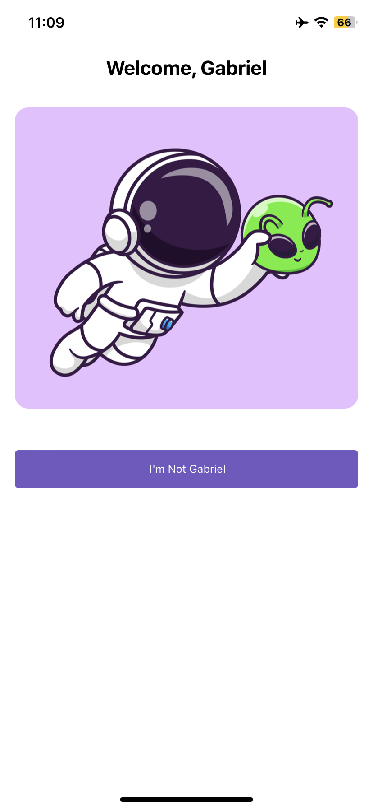

## React Native + TypeScript Proeject

A simple project where I Introduced myself to learn about

<ul>
<li>Hooks</li>
<li>Stylization</li>
<li>Props</li>
</ul>

## To Run 
``npm start``
``expo start``

## To install the libraries
``npm install``

## For some reason the image doesn't appper on the second page on web expo snack veriosn 
 
 

Take a Look how it looks

